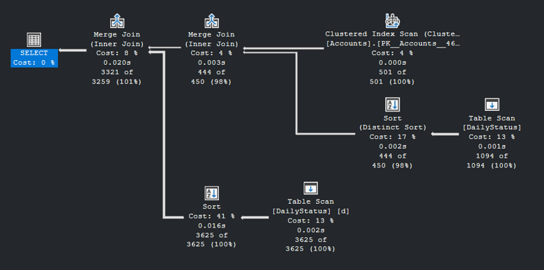

# Technical Assessment – Data Processing & Reporting

## Overview

This project processes account, daily status, and monthly status data provided as CSV files.

The objective was to:

1. Load the provided data into a relational database.
2. Identify accounts with activity on or after `2025-01-01`.
3. Enrich the results with account information.
4. Determine the most recent queue/status change for accounts that were in `COLLECTIONS` or `LEGAL` as of `2025-11-27`.
5. Optimize and measure the performance of a query retrieving daily status information together with account details.

The processing was performed from the database after the initial data load, rather than continuing to work directly with the CSV files.

---

## Tech Stack

- **Python**
- **SQL Server**
- **T-SQL**
- **CSV**

---

## Project Structure

```text
technical-assessment/
│
├── data/
│   └── ...
│
├── sql/
│   ├── 1. TableCreation.sql
│   ├── 3. LoadingData.sql
│   ├── task_2_3_4.sql
│   └── task_5_performance.sql
│
├── python/
│   └── 2. Exploring&ProcessingData.ipynb
│
├── output/
│   ├── accounts_activity.csv
│   └── latest_legal_collections.csv
│
├── images/
│   ├── execution_plan_baseline.png
│   ├── execution_plan_indexed.png
│   └── execution_plan_final.png
│
├── logical_steps.txt
├── performance_comparison.txt
└── README.md
```

# 1. Data Loading and Database Preparation

The original dataset consisted of three types of data:

- **Accounts** – account information such as ID, name and address.
- **Daily Status** – actual queue/status changes with timestamps.
- **Monthly Status** – monthly snapshots representing the latest state of active accounts at the end of each month.

The data was loaded into three database tables:

- `Accounts`
- `DailyStatus`
- `MonthlyStatus`

Data preparation included:

- Reading the CSV files with Python/Polars.
- Handling inconsistent date formats.
- Combining the multiple daily and monthly files.
- Checking for duplicates.
- Checking for missing values.
- Checking for unknown account references.
- Loading the processed data into SQL Server.

After the initial loading step, all subsequent processing was performed using database records.

---

# 2. Accounts With Activity Since January 1, 2025

The first analysis identified all accounts that had a daily queue or status change on or after:

```text
2025-01-01
```

The result contained:

**498 accounts**

The latest daily update for each qualifying account was retained.

---

# 3. Account Activity With Account Details

The activity data was joined with the `Accounts` table to add the account information.

The resulting dataset contains:

| Column                 |
| ---------------------- |
| account_id             |
| name                   |
| address                |
| latest_update_datetime |
| queue                  |
| status                 |

This result was stored in the database as:

```text
account_activity
```

The corresponding CSV output is included in the `output/` directory.

---

# 4. Latest Status for COLLECTIONS / LEGAL

The next step was to determine which accounts were in either:

```text
COLLECTIONS
LEGAL
```

as of **November 27, 2025**.

The November 2025 monthly snapshot was used to establish the state at that point in time.

This produced:

**145 qualifying accounts**

For each account, the Daily Status table was then searched for its most recent actual queue/status change.

Where an account had no corresponding daily history, the latest update was kept as `NULL` rather than inventing a value.

The final result was stored as:

```text
latest_legal_collections
```

The corresponding CSV output is included in the `output/` directory.

---

# 5. Query Performance Optimization

The final task was to measure and improve the performance of reading daily status information together with account details for accounts that had been in `COLLECTIONS` or `LEGAL`.

## Baseline

The original query was executed without the additional indexes.

The execution plan showed a:

**Table Scan**

on `DailyStatus`.

This means SQL Server had to examine a large portion of the table to identify the relevant records.

### Baseline Execution Plan

<!-- ============================================================
TODO: ADD YOUR SCREENSHOT HERE

1. Take a screenshot of the SQL Server "Execution Plan" tab
   for the query WITHOUT the optimization index.

2. Save it as:
   images/execution_plan_baseline.png

3. Put the image inside the repository's "images" folder.

4. The image will automatically appear below this heading on GitHub.

============================================================= -->



---

## Index Optimization

Indexes were then tested to improve the query's ability to locate relevant records.

The following configurations were compared:

1. No index
2. Account-related index
3. Queue-related index
4. Queue + Account indexes

The indexed execution plan showed that SQL Server could use a:

**Nonclustered Index Seek**

instead of scanning the entire `DailyStatus` table.

### Indexed Execution Plan

<!-- ============================================================
TODO: ADD YOUR SCREENSHOT HERE

Take a screenshot of the SQL Server "Execution Plan" tab after
applying the relevant index.

Save it as:

images/execution_plan_indexed.png

Then place that file inside the repository's "images" folder.

============================================================= -->


---

## Performance Results

The exact execution time varied slightly between individual runs because of factors such as caching and the relatively small dataset.

The comparison therefore considers both:

- measured execution time
- changes in the execution plan

### Summary

| Configuration           | Execution plan          | Performance               |
| ----------------------- | ----------------------- | ------------------------- |
| No index                | Table Scan              | Baseline                  |
| Account index           | Index available         | Improved/varied           |
| Queue index             | Index available         | Improved/varied           |
| Queue + Account indexes | Nonclustered Index Seek | Best tested configuration |

> Detailed measurements and the reasoning behind the optimization are documented in `performance_comparison.txt`.

---

# 6. Validation and Data Quality

Several validation checks were performed during processing:

- Date parsing and normalization.
- Duplicate detection.
- Missing-value checks.
- Unknown account references.
- Latest-record selection.
- Validation of queue/status values.
- Verification of record counts after processing.

Particular attention was given to selecting the **latest applicable record** rather than simply selecting the maximum date independently for each field.

---

# 7. Output Files

The assessment requires the following outputs:

### Activity accounts

```text
output/accounts_activity.csv
```

Contains accounts with activity on or after January 1, 2025 together with their account details.

### Latest COLLECTIONS / LEGAL status

```text
output/latest_legal_collections.csv
```

Contains the latest relevant queue/status information for accounts that were in `COLLECTIONS` or `LEGAL` as of November 27, 2025.

### Logical processing steps

```text
logical_steps.txt
```

Documents the logical steps followed to solve Tasks 1–4 and the relevant data validation decisions.

### Performance comparison

```text
performance_comparison.txt
```

Documents the baseline query, optimization attempts, execution-plan changes and measured performance.

---

# 8. Key Result

The project demonstrates an end-to-end data processing workflow:

```text
CSV files
    ↓
Python / Polars
    ↓
Data cleaning & validation
    ↓
SQL Server
    ↓
Database processing
    ↓
Task-specific queries
    ↓
Performance optimization
    ↓
CSV outputs + documentation
```

The final optimization demonstrated that changing the database access path from a table scan to an index seek can reduce the amount of data SQL Server needs to examine when filtering the daily status records.

# Data-Processing-Reporting-Assessment
